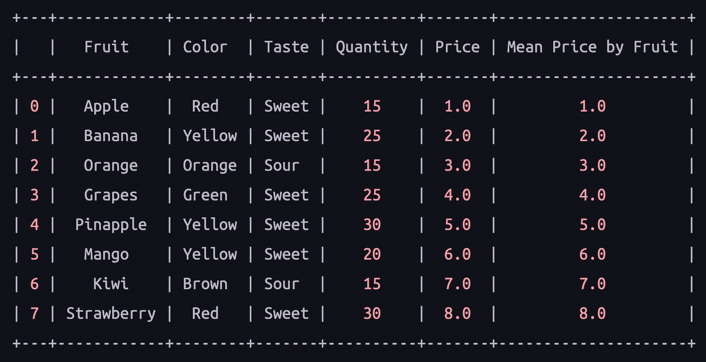
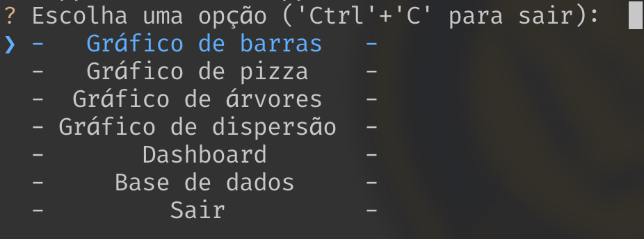
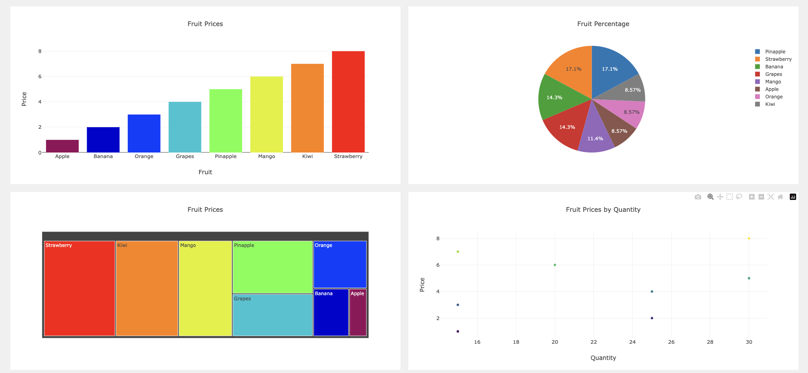

# PyDash

**PyDash** é um projeto de dashboard desenvolvido em Python, que permite a visualização de diferentes tipos de gráficos. Este projeto utiliza bibliotecas de visualização de dados, interação de linha de comando e manipulação de dados.

